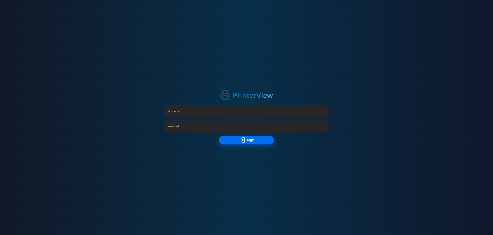
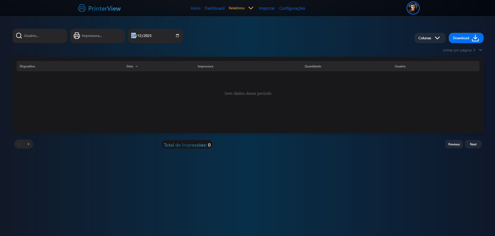

# 🖨️ Printerview

Printerview is a software 🖥️ designed to display CSV data from the printer server on a web view for analysis. It extends the functionality of PaperCut Print Logger, a free print logging application for Windows systems, by providing real-time activity logs detailing all printer use.

## 💻 Technologies

### 🌐 Frontend

- Next.js
- Axios
- Nookies
- React-Hook-Form
- Zod validation
- SWR (stale-while-revalidate)
- TailwindCSS

### ⚙️ Backend

- Python
- Flask API
- JWT validation
- Pandas

## 🛠️ Environment Variables

To run the project, make sure you have the following environment variables set:

- `ADMIN_USER`: Lucas-Ribeiro-Lima
- `ADMIN_PASSWD`: 12345
- `SECRET_KEY`=TR988ugdG0Le92TaI9rNziz

## 🎨 Illustration

### 🖼️ Login Screen



### 📊 Report



## 🚀 How to Run the Project

1. Install Python
  ```shell
    python --version
    pip install -r requirements.txt
    python run app.py
  ```


2. Install Node
  ```shell
   node --version
   npm --version
   npm install
   npm run dev 
  ```